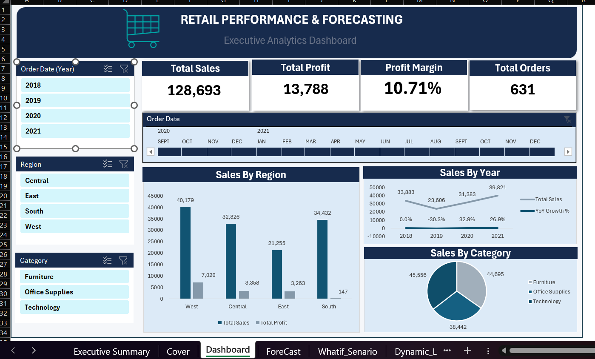
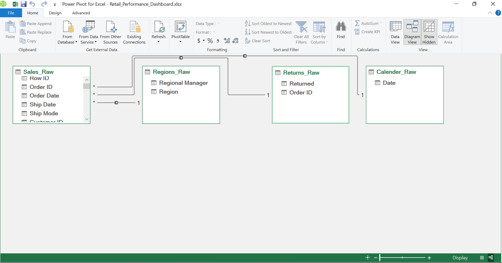
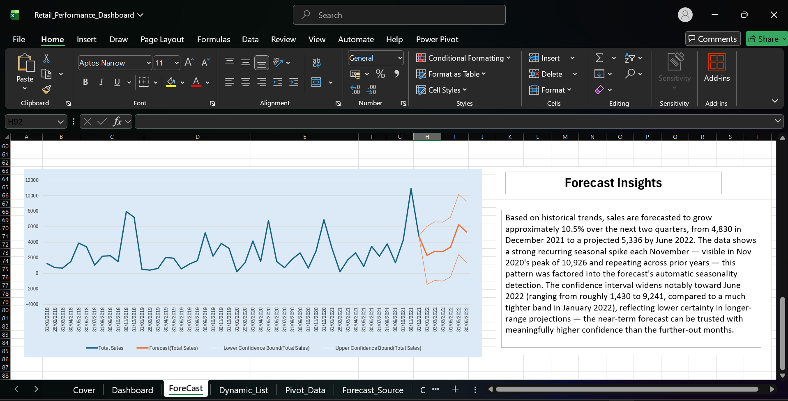
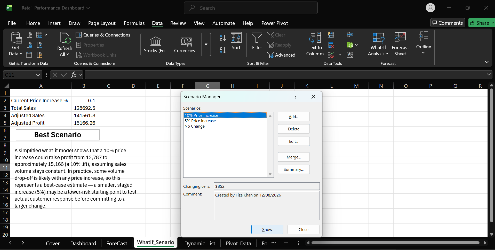

# Retail Performance & Forecasting Dashboard (Advanced Excel)

## Business Problem
Built for a retail manager deciding where to focus resources next quarter — 
which regions/categories to invest in, and what pricing changes might do to profit.

## Data Source
Tableau Sample Superstore dataset

## Tools & Techniques
- Power Query (data cleaning, ETL)
- Power Pivot & Data Modeling (relationships across multiple tables)
- DAX measures (Total Sales, Profit Margin %, YoY Growth %)
- Dynamic Array Formulas (UNIQUE, FILTER, SORT)
- Forecasting (Excel Forecast Sheet)
- What-If Scenario Analysis (Scenario Manager)
- VBA Macro automation (one-click refresh + PDF export)

## Dashboard

## Data Model

## Forecast

## What-If Scenario

## Key Insights
- **West** is the strongest region — highest profit margin (17.47%) and 
  highest profit ($7,020) alongside solid sales ($40,179)
- **South** is a red flag — second-highest sales ($34,432) but almost no 
  profit margin (0.43%), suggesting heavy discounting or cost issues worth 
  investigating further
- **Office Supplies** is the most efficient category — not the highest 
  revenue, but the best margin (19.44%) and highest profit ($7,472) of 
  any category
- **Furniture** shows the inverse pattern — strong sales ($44,695) but the 
  weakest margin (5.29%), meaning a lot of that revenue isn't converting to profit
- Margins have declined over time (18.09% in 2018 → 5.56% in 2021) even as 
  sales grew — the business is selling more but keeping less per sale
- Forecast: ~10.5% sales growth projected into mid-2022, with a clear 
  seasonal spike each November
- A 5% price increase is recommended over a 10% increase as a lower-risk 
  way to test demand response before committing further

**Full write-up:** [see the Executive Summary sheet in the dashboard file]

## How to Use
Download the .xlsx file, enable macros if prompted, and use the slicers 
and timeline on the Dashboard sheet to filter by region, category, and date range.
